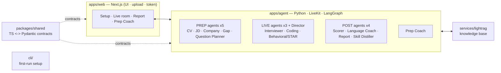

# Proven Hire Job Description Interview

Voice-first, multilingual AI mock interviewer. Upload a CV and a job
description, talk to an AI interviewer out loud, and get a scored report with
coaching on what you missed.

Proven Hire closes the **prep ⇄ interview ⇄ feedback** loop: heavy reasoning
runs *before* the call (read your CV + the JD, research the company, build an
adaptive question plan), a lean real-time voice loop runs the interview, then
scoring models grade it and route you into a study coach for your weak areas.

## Requirements

- Node **20+** (22 recommended — see [`.nvmrc`](.nvmrc))
- pnpm 11
- Python 3.11+ with [uv](https://docs.astral.sh/uv/) (for the agent)
- Docker (for the full stack)

## Quickstart

**No sign-in required.** Self-hosting runs anonymously — setup, the live
interview, and the report all work with no account and no login. The
`/setup` screen has a one-click **Quick demo** that fills a sample CV + JD, so
you can try the whole loop without uploading anything.

### 1. Offline path (no API keys needed)

Builds the contracts, runs the test suites, and exercises the prep/live/post
pipelines against mock adapters.

```bash
git clone https://github.com/APPARAOsiddapureddy/provenhire_jobdescription_interview.git
cd provenhire_jobdescription_interview

pnpm install          # install the JS/TS workspace
pnpm build            # build packages/shared (contracts) + cli + web
pnpm test             # TS + Pydantic parity + pipeline tests (offline, mock adapters)

pnpm proven-hire init   # scaffold .env from .env.example (fill in keys later)
```

> `pnpm build` must run before `pnpm proven-hire init` — the CLI is built into
> `cli/dist/`. For the Python agent: `uv --directory apps/agent sync` then
> `uv --directory apps/agent run pytest`.

### 2. Full-stack path (Docker)

```bash
pnpm proven-hire init      # or: cp .env.example .env  (keys are optional)
docker compose up --build  # web (:3000) + agent API (:8000) + lightrag (:9621)
```

- Docker reads the repo-root `.env` (compose `env_file`). Local dev
  (`pnpm dev`) instead reads `apps/agent/.env` and `apps/web/.env.local` —
  keys there are **not** visible to containers, so put them in the root
  `.env` for Docker.
- The **live voice worker** is opt-in: `docker compose --profile live up`. It
  requires `LIVEKIT_URL` / `LIVEKIT_API_KEY` / `LIVEKIT_API_SECRET` (plus
  STT/TTS/LLM keys) in the root `.env`; without them the worker exits and
  restart-loops while the base stack keeps running.

### 3. Run it fully local (no cloud keys at all)

```bash
pnpm proven-hire init      # choose "100% local models"
```

Sets `LLM_PROVIDER=ollama`, `STT_PROVIDER=whisper`, `TTS_PROVIDER=kokoro` —
every model runs on your machine, no LLM/STT/TTS keys, and nothing about your
CV leaves your box. LiveKit is still the real-time transport (use LiveKit
Cloud, or `livekit-server --dev` for a fully offline stack). Full setup,
hardware notes and troubleshooting: [docs/LOCAL_MODELS.md](docs/LOCAL_MODELS.md).

<details><summary>Configuring providers & adding a language pack</summary>

- **Keys** live in `.env` only (never committed). See
  [`.env.example`](.env.example) for the full list (LiveKit, Supabase, R2,
  STT/TTS/LLM, Tavily/Exa, observability).
- **Provider choice** is per-component: set `STT_PROVIDER`, `TTS_PROVIDER`,
  `LLM_PROVIDER` and the matching key. With no keys set, the agent falls back
  to mock adapters so everything still runs offline.
- **Languages** are pluggable packs. UI strings live in
  `apps/web/lib/i18n/messages/` (EN + VI shipped); each planned question's
  `text` is a `LocalizedText` map (`text.en` / `text.vi` / …) alongside a
  `language_mode`.

</details>

## Provider matrix

Every stage is swappable. The live voice loop is cascaded **STT → LLM → TTS**
over LiveKit; pick each vendor with one env var plus its key. With no keys
set, every stage falls back to an offline mock adapter.

| Stage | Choose with | Cloud vendors (pick one) | Fully local | No key set |
|---|---|---|---|---|
| **STT** | `STT_PROVIDER` | Deepgram nova-3 (default) · Soniox | `whisper` · `qwen3-asr` — any OpenAI-compatible server | mock adapter |
| **TTS** | `TTS_PROVIDER` | Cartesia sonic (default) · ElevenLabs Flash v2.5 · Gemini TTS | `kokoro` — kokoro-fastapi | mock adapter |
| **LLM** | `LLM_PROVIDER` | Gemini live tier (default) · OpenAI | `ollama` — e.g. Qwen3 | mock adapter |

## Architecture

The spine of the system is a **prep / live / post** split (strong async
models before and after the call; one lean fast model on the live turn
path). All three phases thread a single shared `InterviewContext`
"blackboard" — written in prep, read+appended in live, read in post.



**Module boundaries:** `apps/web` owns UI/auth/upload/token and knows nothing
about LLM/STT/TTS · `apps/agent` owns the voice loop + prep/post pipelines +
avatar render util · `services/lightrag` owns the knowledge base · `cli/`
owns first-run setup · `packages/shared` is the cross-language contract (TS
source of truth, mirrored as Pydantic).

Full request-flow diagrams and the multi-agent design live in
[`docs/ARCHITECTURE.md`](docs/ARCHITECTURE.md). Deployment notes live in
[`docs/DEPLOY.md`](docs/DEPLOY.md).

## License

[Apache-2.0](LICENSE)
